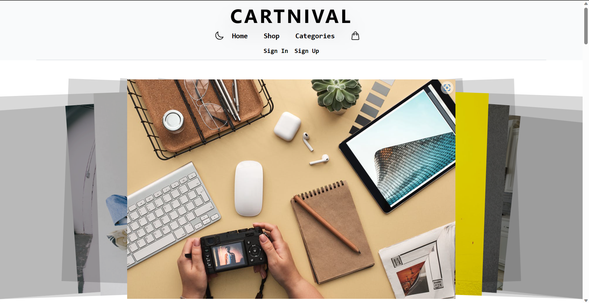
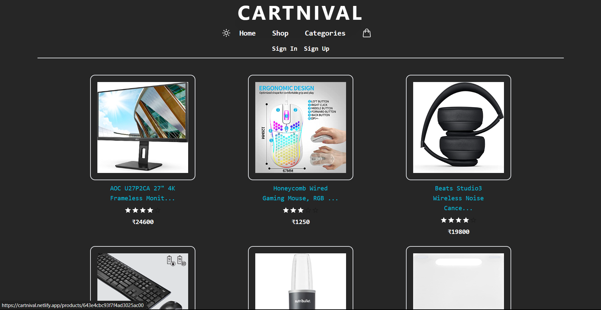
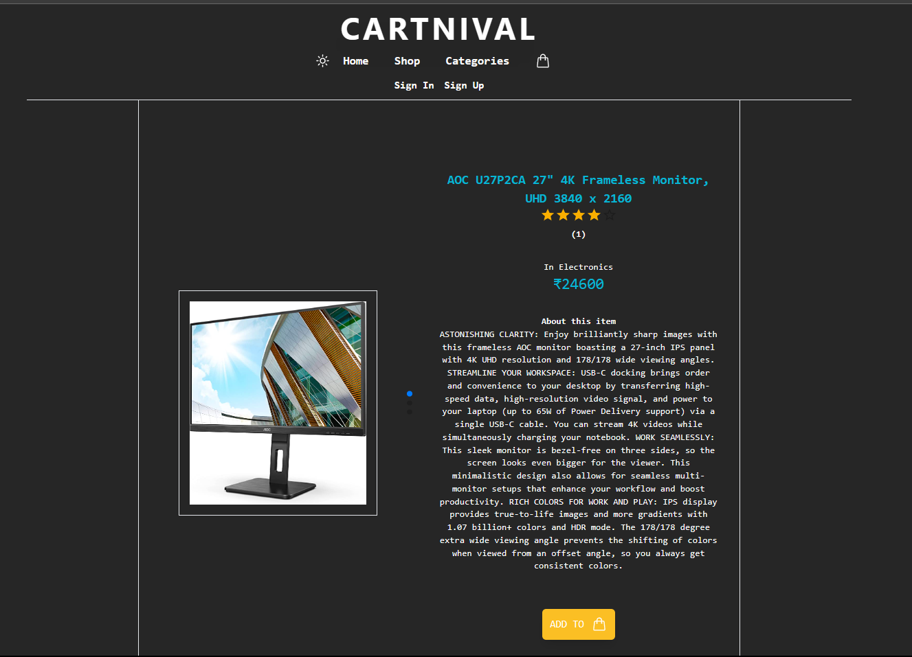
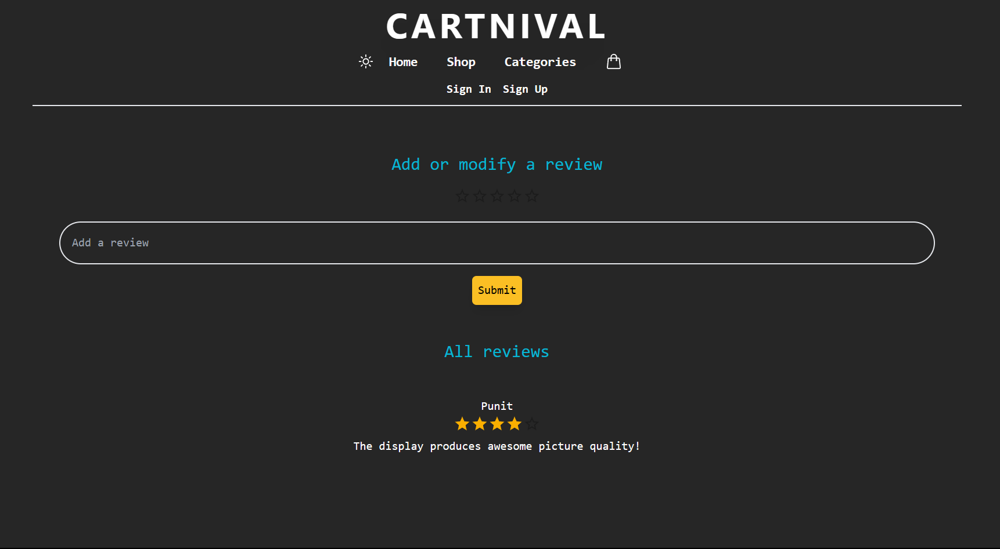
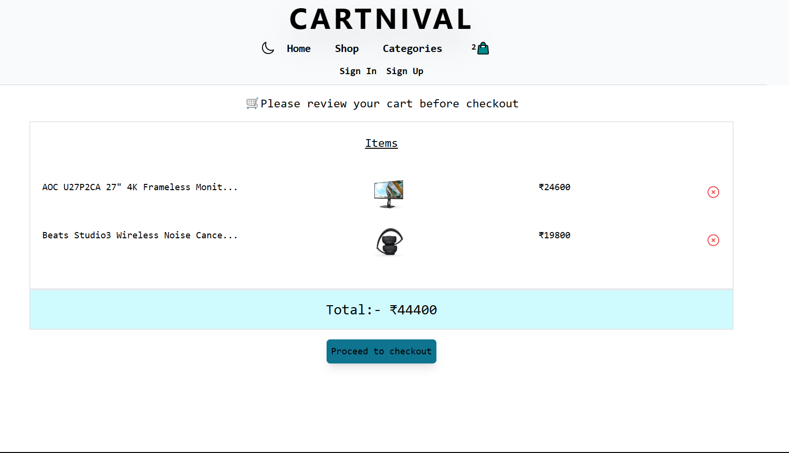
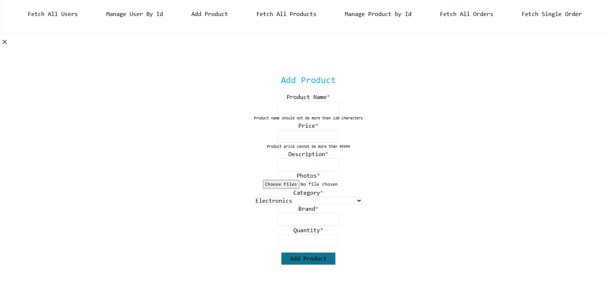

# CARTNIVAL A FULL STACK E-COMMERCE WEB APPLICATION

---

- This project is a part of the Internship program by iNeuron.
- This project is build to demonstrate a full stack application build with scalable technologies like MongoDB, Express.js, React.js, Node.js, Mongoose ODM & many other Javascript Libraries.
- This project has an aesthetic frontend appealing to the eyes.
- This project has a seperate admin dashboard to manage the products, orders and user roles throughout the application.
- This project has an integrated payment processor Stripe to make payments to this app under test mode.
- This project also has a dark mode theme where you can switch the website from light mode to dark mode or vice-a-versa.
- This project is completly responsive it looks awesome even on mobile phones, desktop's and even tablets.
- Technologies used to design the webpage

  
AND MANY MORE JAVASCRIPT LIBRARIES

## This is the first Full Stack Application I have ever made

## Learnings

- After understanding all the technologies and getting hand's on experience by building one or two small projects, I had to start combining all the technologies and go for one big project.
- I started of with building the API where I learnt how to do user authentication via backend, I also learnt about Bcrypt.js and JWT while adding auth to my application, I also leant about node mailer and mail trap to send emails via our backend I used it to handle the forgot password situation.
- I also learnt about the Validator library which allow us to write custom errors which are easy to read.
- I also learnt how to upload images and other assets onto the cloud via our application using Cloudinary, I used cloudinary to upload product images on the cloud.
- I learnt how to integrate Stripe in a full stack application and also how to send the PK to the frontend, I also added a webhook with Stripe for listening to an event from where I could retrive order details and add an order onto my database.
- I also understood about CORS and how to establish CORS on my server to listen for events from the frontend of my application.
- I also learnt a lot new things about React.
- I learnt how to use Axios to fetch, post, delete, modify something from the API.
- I learnt how to implement Redux and make slice methods to achieve functionalities that would alter the state of my variables.
- I learnt how to use Swiper.js to make super cool sliders.
- I learnt how to use inbuilt dark mode on tailwind css.
- These are some of the learnings I could recollect but I learnt a lot more than the things mentioned above this project was perfect to showcase my skills and take my learnings to a whole new level.
- This project conatins CRUD operations on multiple aspects of the website like reviews, orders, products, ect onto the database.
- This project almost took me more than **50 days** to complete and tought me a lot of cool new JS libraries and a lot of other important programmings skills.

## Preview

## Made By Punit Bathija
